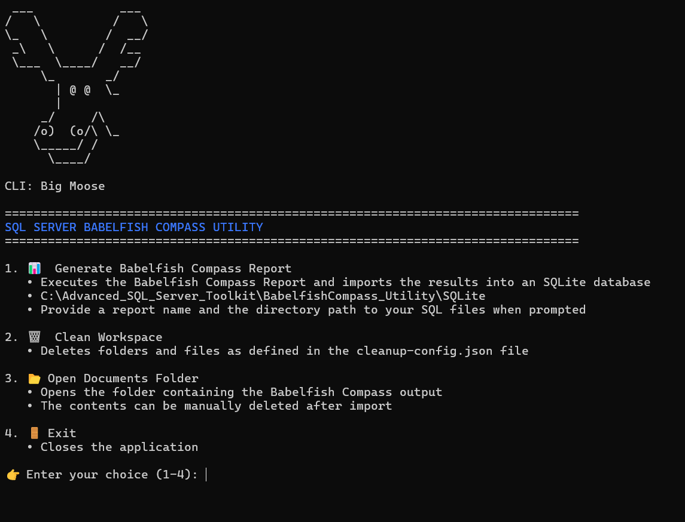

# Babelfish Compass Report - Execution Guide

**Author:** Scott Peters  
**Date:** November 6, 2025

---


## Overview

This document provides instructions for running Babelfish Compass.

⚡ **For automated execution**, use the CLI Python script:
`C:\Advanced_SQL_Server_Toolkit\BabelfishCompass_Utility\CLI - BablefishCompass Utility.py`

🔍 Babelfish Compass performs T-SQL code analysis by accepting two inputs from the user: a directory path containing SQL files and a report name. The tool recursively processes all SQL files in the specified directory, analyzes the T-SQL syntax and structure using the ANTLR 4 parser, and stores the detailed analysis results in an SQLite database for easy querying and reporting.

---

## 🚀 Quick Start - Using the CLI (Recommended)

The easiest way to use Babelfish Compass is through the interactive CLI menu:



### Running the CLI

```cmd
cd C:\Advanced_SQL_Server_Toolkit\BabelfishCompass_Utility
python "CLI - BablefishCompass Utility.py"
```

### CLI Features

The CLI provides a menu-driven interface with the following options:

#### 1. 📊 Generate Babelfish Compass Report
- **What it does:** Executes all three steps automatically:
  1. Generates the Babelfish Compass report from your SQL files
  2. Creates the DAT file for database import
  3. Imports the data into an SQLite database
- **Prompts:**
  - Report name (or press Enter for default: "MyReport")
  - SQL source directory path (or press Enter for default: `SQL_Examples`)
- **Output:** SQLite database at `SQLite/{report_name}.db`

#### 2. 🗑️ Clean Workspace
- **What it does:** Deletes temporary files and folders as defined in `Config/cleanup-config.json`
- **Use case:** Free up disk space after completing your analysis
- **Safety:** Prompts for confirmation before deleting anything

#### 3. 📂 Open Documents Folder
- **What it does:** Opens `C:\Users\{username}\Documents\BabelfishCompass`
- **Use case:** View or manually delete temporary Babelfish Compass output files
- **Note:** These files can be safely deleted after the SQLite import is complete

#### 4. 🚪 Exit
- Closes the application

### Example CLI Workflow

```
1. Run the CLI:
   python "CLI - BablefishCompass Utility.py"

2. Select option 1 (Generate Report)

3. Enter report name: MyAnalysis
   (or press Enter for default "MyReport")

4. Enter SQL directory: C:\MyProject\SQL
   (or press Enter for default SQL_Examples)

5. Confirm: yes

6. Wait for processing (may take several minutes)

7. Result: SQLite database created at:
   C:\Advanced_SQL_Server_Toolkit\BabelfishCompass_Utility\SQLite\MyAnalysis.db
```

### CLI Advantages

✅ **Automated** - All three steps run automatically
✅ **Interactive** - Prompts guide you through the process
✅ **Error Handling** - Clear error messages and validation
✅ **Console Logging** - Real-time timestamped logging to console window
✅ **Safe** - Validates inputs and confirms destructive operations

---


### Directory Structure

| Component                     | Location                                                                    |
|-------------------------------|-----------------------------------------------------------------------------|
| **Babelfish Compass Utility** | `C:\Advanced_SQL_Server_Toolkit\BabelfishCompass_Utility\BabelfishCompass` |
| **Automation Tools**          | `C:\Advanced_SQL_Server_Toolkit\BabelfishCompass_Utility`                  |

### About Babelfish Compass

Babelfish Compass is a standalone compatibility assessment tool originally designed to help migrate applications from Microsoft SQL Server to Babelfish for PostgreSQL on Amazon Web Services (AWS). It analyzes T-SQL scripts and generates detailed compatibility reports.

**Our Use Case:**  
🔍 Rather than using Babelfish Compass for compatibility assessment, we leverage its powerful **ANTLR 4** (ANother Tool for Language Recognition) parser for T-SQL code analysis. By repurposing this existing tool, we avoid the complexity of implementing ANTLR from scratch while gaining access to a mature, production-ready T-SQL parser. This provides comprehensive grammatical understanding of SQL Server syntax, including stored procedures, functions, and complex queries.

https://www.antlr.org/


### Report Output Location

When generating a report, temporary files are saved to:  
`C:\Users\<username>\Documents\BabelfishCompass`

> **Note:** You may delete this folder after completing the report to free up disk space. The important data is preserved in the SQLite database.

---

## Updating Babelfish Compass

To update the Compass Report utility to the latest version:

1. **Visit the official repository:**
   https://github.com/babelfish-for-postgresql/babelfish_compass

2. **Download the latest release contents**

3. **Replace the existing installation directory:**
   `C:\Advanced_SQL_Server_Toolkit\BabelfishCompass_Utility\BabelfishCompass`

---

## Quick Guide (Manual Execution)

⚠️ **Note:** For most users, the [CLI (above)](#-quick-start---using-the-cli-recommended) is the recommended approach.

This section provides instructions for running Babelfish Compass manually if you need more control over individual steps.

Execute the following via command line (CMD):

### 1. Change to the BabelfishCompass directory
```cmd
cd /d C:\Advanced_SQL_Server_Toolkit\BabelfishCompass_Utility\BabelfishCompass
```

### 2. Run Step 1 - Generate Report
```cmd
BabelfishCompass.bat MyReport C:\Advanced_SQL_Server_Toolkit\BabelfishCompass_Utility\SQL_Examples -delete -recursive -nopopupwindow
```

### 3. Run Step 2 - Generate DAT file
```cmd
BabelfishCompass.bat MyReport -pgimport "host,port,user,password,database"
```

### 4. Run Step 3 - Import into SQLite
```cmd
python C:\Advanced_SQL_Server_Toolkit\BabelfishCompass_Utility\Core\Python\03_Import_DAT_to_SQLite.py
```

---

## Detailed Instructions

---

## STEP 1: Generate the Babelfish Compass Report

### Change to the directory where BabelfishCompass.bat is located:
```cmd
cd /d C:\Advanced_SQL_Server_Toolkit\BabelfishCompass_Utility\BabelfishCompass
```

### Run the following command to create the initial assessment report:
```cmd
BabelfishCompass.bat MyReport C:\Advanced_SQL_Server_Toolkit\BabelfishCompass_Utility\SQL_Examples -delete -recursive -nopopupwindow
```

### Parameters to Modify:
| Paramete r            | Description                                          |
|-----------------------|------------------------------------------------------|
| `MyReport`            | Replace with your desired report name                |
| `C:\...\SQL_Examples` | Replace with the directory containing your SQL files |

### Parameters (Fixed):
| Parameter        | Description                                              |
|------------------|----------------------------------------------------------|
| `-delete`        | Deletes existing report (if any) before creating new one |
| `-recursive`     | Processes all subdirectories                             |
| `-nopopupwindow` | Suppresses automatic opening of HTML report and folder   |

> **Note:** The `-delete` flag ensures a clean report generation each time.

---

## STEP 2: Generate DAT File for Database Import

### Change to the directory where BabelfishCompass.bat is located:
```cmd
cd /d C:\Advanced_SQL_Server_Toolkit\BabelfishCompass_Utility\BabelfishCompass
```

This step creates a DAT file that can be imported into any database (SQLite, Firebird, PostgreSQL, etc.).

The command will attempt to import into PostgreSQL and fail (unless PostgreSQL is configured). **This is expected** - the important output is the DAT file.

### Run the following command:
```cmd
BabelfishCompass.bat MyReport -pgimport "host,port,user,password,database"
```

### Parameters to Modify:
| Parameter                          | Description                                         |
|------------------------------------|-----------------------------------------------------|
| `MyReport`                         | Must match the report name from Step 1              |
| `host,port,user,password,database` | PostgreSQL connection details (can be dummy values) |

### Output Location:
The DAT file will be created at:
```
C:\Users\{username}\Documents\BabelfishCompass\{report_name}\captured\pg_import.dat
```

### Important Notes:
- ✓ The PostgreSQL import will fail - **this is expected**
- ✓ The DAT file is still created and can be imported into your database of choice
- ✓ The DAT file is a semi-colon delimited (`;`) text file

---

## STEP 3: Import DAT File into SQLite Database

Execute the Python script to import the Babelfish Compass data into SQLite:

```cmd
python 03_Import_DAT_to_SQLite.py
```

### When prompted:
- Enter your report name (e.g., "MyReport")
- Or press Enter to use the default name "MyReport"

### The script will:
1. Automatically detect your Windows username
2. Locate the DAT file at:
   `C:\Users\{username}\Documents\BabelfishCompass\{report_name}\captured\pg_import.dat`
3. Create an SQLite database at:
   `C:\Advanced_SQL_Server_Toolkit\BabelfishCompass_Utility\SQLite\{report_name}.db`

> **Note:** If the database already exists, it will be replaced with fresh data.

### Example:
```
Report name: MyReport
Database created: C:\Advanced_SQL_Server_Toolkit\BabelfishCompass_Automate\SQLite\MyReport.db
```

---

## OPTIONAL: PostgreSQL Import Parameters

If you have PostgreSQL installed with `psql` in your PATH and want to import directly, you can use these additional parameters:

| Parameter                                      | Description                                       |
|------------------------------------------------|---------------------------------------------------|
| `-pgimport "host,port,user,password,database"` | PostgreSQL connection string                      |
| `-pgimportappend`                              | Appends to existing table (doesn't drop/recreate) |
| `-pgimporttable schema.table`                  | Target table name (default: `public.BBFCompass`)  |

### Example with all options:
```cmd
BabelfishCompass.bat MyReport -pgimport "localhost,5432,postgres,MyPassword,mydb" -pgimportappend -pgimporttable import_data.bbfcompass
```


---

## File Locations Reference

| Item                 | Location                                                                                               |
|----------------------|--------------------------------------------------------------------------------------------------------|
| **CLI Script** | `C:\Advanced_SQL_Server_Toolkit\BabelfishCompass_Utility\CLI - BablefishCompass Utility.py` |
| BabelfishCompass.bat | `C:\Advanced_SQL_Server_Toolkit\BabelfishCompass_Utility\BabelfishCompass\`                           |
| SQL Examples         | `C:\Advanced_SQL_Server_Toolkit\BabelfishCompass_Utility\SQL_Examples\`                               |
| DAT File Output      | `C:\Users\{username}\Documents\BabelfishCompass\{report_name}\captured\pg_import.dat`                  |
| SQLite Database      | `C:\Advanced_SQL_Server_Toolkit\BabelfishCompass_Utility\SQLite\{report_name}.db`            |
| Console Logging      | Real-time timestamped logging displayed in console window (no log files)                              |
| Configuration        | `C:\Advanced_SQL_Server_Toolkit\BabelfishCompass_Utility\Config\config.json`                          |

---

**End of Document**

