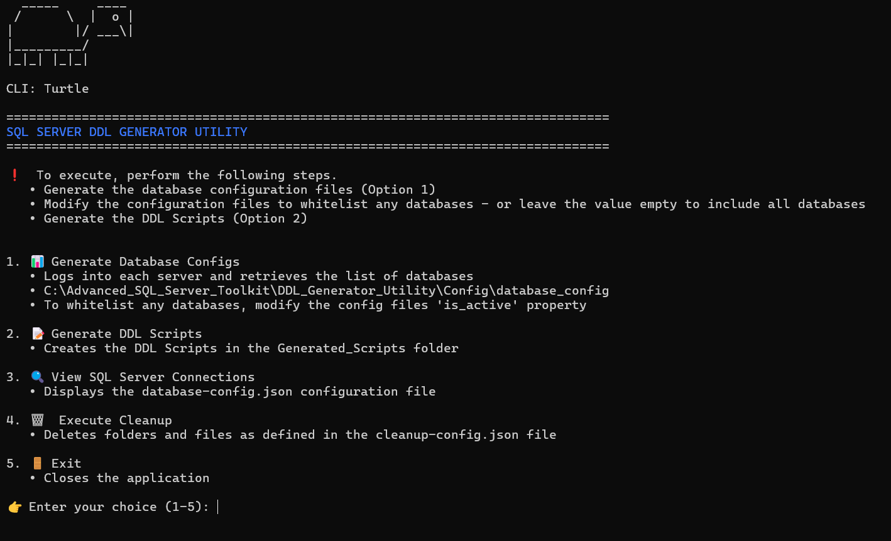

# DDL Generator Utility

An automated Python-based utility for generating Data Definition Language (DDL) scripts from SQL Server databases using Microsoft's `mssql-scripter` tool. This utility streamlines the process of extracting database schemas, stored procedures, views, functions, and table definitions across multiple SQL Server instances.

## Overview

The DDL Generator Utility provides a command-line interface for automating the extraction of database objects from SQL Server environments. It connects to multiple SQL Server instances, discovers databases, and generates organized DDL scripts for version control, documentation, or migration purposes.

⚡ **For automated execution**, use the interactive CLI:
`C:\Advanced_SQL_Server_Toolkit\DDL_Generator_Utility\CLI - DDL Generator Utility.py`

---

## 🚀 Quick Start - Using the CLI (Recommended)

The easiest way to use the DDL Generator is through the interactive CLI menu:



### Running the CLI

```cmd
cd C:\Advanced_SQL_Server_Toolkit\DDL_Generator_Utility
python "CLI - DDL Generator Utility.py"
```

### CLI Features

The CLI provides a menu-driven interface with the following options:

#### 1. 📊 Generate Database Configs
- **What it does:** Connects to each SQL Server instance and retrieves the list of all databases
- **Output:** Creates configuration files in `Config/database_config/` (one file per server)
- **Configuration:** Each database has an `is_active` property that can be set to `true` or `false`
- **Use case:** Run this first to discover all databases on your SQL Servers
- **Tip:** After generation, edit the config files to whitelist specific databases by setting `is_active: true`

#### 2. 📝 Generate DDL Scripts
- **What it does:** Executes all three processing steps automatically:
  1. Reads database configurations from `Config/database_config/`
  2. Creates the directory structure (`Generated_Scripts/Parent/Server/Database/`)
  3. Runs `mssql-scripter` to generate DDL scripts for all active databases
- **Output:** DDL scripts organized by Parent/Server/Database hierarchy
- **Prerequisites:** Must run "Generate Database Configs" first (Option 1)
- **Duration:** May take several minutes to hours depending on database size and count

#### 3. 🔍 View SQL Server Connections
- **What it does:** Displays the contents of `Config/database-config.json`
- **Shows:**
  - Server names and connection details
  - Active/inactive status for each server
  - Database inclusion filters
  - Authentication credentials (passwords masked)
- **Use case:** Verify your SQL Server connections before generating configs

#### 4. 🗑️ Execute Cleanup
- **What it does:** Deletes temporary files and folders as defined in `Config/cleanup-config.json`
- **Safety:** Prompts for confirmation before deleting anything
- **Use case:** Clean up generated scripts and config files to start fresh

#### 5. 🚪 Exit
- Closes the application

### Example CLI Workflow

```
1. Run the CLI:
   python "CLI - DDL Generator Utility.py"

2. Select option 3 (View SQL Server Connections)
   - Verify your servers are configured correctly

3. Select option 1 (Generate Database Configs)
   - Wait for database discovery to complete
   - Review generated config files in Config/database_config/

4. Edit config files (optional):
   - Open Config/database_config/database_config_ServerName.json
   - Set "is_active": true for databases you want to include
   - Set "is_active": false for databases you want to exclude

5. Select option 2 (Generate DDL Scripts)
   - Confirm when prompted
   - Wait for DDL generation to complete (may take a while)

6. Result: DDL scripts created in:
   Generated_Scripts/ParentName/ServerName/DatabaseName/
```

### CLI Advantages

✅ **Automated** - All processing steps run automatically
✅ **Interactive** - Menu-driven interface with clear prompts
✅ **Error Handling** - Clear error messages and validation
✅ **Console Logging** - Real-time timestamped logging to console window
✅ **Safe** - Confirms destructive operations before executing
✅ **Progress Tracking** - Real-time feedback during long operations

---

## Key Features

- **Multi-Server Support**: Connect to and process multiple SQL Server instances simultaneously
- **Automated Discovery**: Automatically discovers all databases on configured SQL Server instances
- **Selective Processing**: Configure which databases to include or exclude from DDL generation
- **Organized Output**: Creates a hierarchical directory structure (Parent/Server/Database) for generated scripts
- **Flexible Export Options**: Export table DDL to single files or individual object scripts (views, functions, stored procedures)
- **Configuration-Driven**: JSON-based configuration for servers, databases, and export commands
- **Progress Tracking**: Real-time progress display during DDL generation
- **Console Logging**: Real-time timestamped logging for troubleshooting and audit trails
- **Interactive CLI**: User-friendly command-line interface with menu-driven options

## Architecture

⚠️ **Note:** For most users, the [CLI (above)](#-quick-start---using-the-cli-recommended) is the recommended approach. The information below describes the underlying architecture for advanced users.

### Core Components

The utility consists of three main processing scripts located in `Core/Python/`:

1. **Database Configuration Generator** (`01_generate_database_configs.py`): Connects to SQL Server instances and creates individual configuration files for each discovered database
2. **Directory Structure Creator** (`02_create_directory_structure.py`): Builds the output directory hierarchy based on database configurations
3. **DDL Script Executor** (`03_execute_mssql_scripter.py`): Runs `mssql-scripter` commands to generate DDL scripts for active databases

### Configuration Files

- **config.json**: Main configuration file containing paths and database connection parameters
- **database-config.json**: Defines SQL Server instances, credentials, and connection details
- **commands-config.json**: Configurable `mssql-scripter` commands for different export scenarios
- **database_config/*.json**: Auto-generated configuration files for each database (one per server)
- **config_loader.py**: Centralized configuration loader class for type-safe access to settings

## Workflow

### Step 1: Generate Database Configurations

The utility connects to each SQL Server instance defined in `database-config.json` and:
- Queries the master database for all available databases
- Creates a configuration file containing database metadata (name, state, recovery model, etc.)
- Marks databases as active/inactive based on their state
- Stores configuration in the `Config/database_config/` directory

### Step 2: Generate DDL Scripts

Once database configurations are created:
- Creates the output directory structure (`Generated_Scripts/Parent/Server/Database/`)
- Executes configured `mssql-scripter` commands for each active database
- Generates DDL scripts for tables, views, stored procedures, functions, and other objects
- Organizes output files by database and object type

## Output Structure

Generated scripts are organized hierarchically:

```
Generated_Scripts/
├── ParentName1/
│   ├── ServerName1/
│   │   ├── Database1/
│   │   │   ├── ParentName1.Database1.TablesFull.sql
│   │   │   ├── dbo.StoredProcedure1.sql
│   │   │   ├── dbo.View1.sql
│   │   │   └── ...
│   │   └── Database2/
│   │       └── ...
│   └── ServerName2/
│       └── ...
└── ParentName2/
    └── ...
```

## Export Options

The utility supports multiple export configurations:

- **Table DDL**: Exports all table definitions, schemas, user-defined types, and table types to a single file
- **Programmability Objects**: Exports views, functions, and stored procedures as individual files
- **Custom Commands**: Define additional `mssql-scripter` commands in `commands-config.json`

## Requirements

- **Python 3.7+**: Required for running the utility scripts
- **mssql-scripter**: Microsoft's command-line tool for scripting SQL Server objects
- **pyodbc**: Python library for SQL Server connectivity
- **SQL Server Access**: Appropriate permissions to read database metadata and objects

## Configuration

The utility uses JSON-based configuration files for all settings:

### `Config/config.json` - Main Configuration

```json
{
  "paths": {
    "workspace_dir": "C:\\Advanced_SQL_Server_Toolkit\\DDL_Generator_Utility",
    "output_dir": "Generated_Scripts",
    "config_dir": "Config"
  },
  "files": {
    "database_config": "database-config.json",
    "commands_config": "commands-config.json"
  }
}
```

**Note:** Logging is now handled via console output only. The `log_dir` and `logging` configuration sections have been removed.

### `Config/database-config.json` - SQL Server Connections

Define your SQL Server instances:
- Server name and parent grouping
- Authentication credentials (SQL Server or Windows Authentication)
- Active/inactive status for selective processing

### `Config/commands-config.json` - Export Commands

Customize DDL export behavior:
- Define which object types to export
- Specify output file naming conventions
- Configure `mssql-scripter` parameters
- Enable/disable specific export commands

## Use Cases

- **Version Control**: Generate DDL scripts for tracking database schema changes in Git
- **Documentation**: Create comprehensive database documentation from live systems
- **Migration Planning**: Extract schemas for database migration projects
- **Disaster Recovery**: Maintain up-to-date DDL backups for rapid recovery
- **Environment Comparison**: Compare schemas across development, test, and production environments
- **Compliance & Audit**: Document database structures for regulatory requirements

## Console Logging

All operations are logged to the console window with timestamps and severity levels:
- Real-time logging displayed in the console window
- Timestamped messages in format: `[YYYY-MM-DD HH:MM:SS] [LEVEL] message`
- Log levels: INFO, WARNING, ERROR
- Detailed error messages for troubleshooting
- No log files created (console output only)

## Best Practices

- Review and update `database-config.json` before running the utility
- Test with a small number of databases before processing entire environments
- Verify `mssql-scripter` is installed and accessible from the command line
- Review generated configurations in `Config/database_config/` before DDL generation
- Use version control to track changes in generated DDL scripts
- Schedule regular executions to maintain current schema documentation

---

## File Locations Reference

| Item | Location |
|------|----------|
| **CLI Script** | `CLI - DDL Generator Utility.py` |
| Core Python Scripts | `Core/Python/` |
| Main Configuration | `Config/config.json` |
| SQL Server Connections | `Config/database-config.json` |
| Export Commands | `Config/commands-config.json` |
| Database Configs (Generated) | `Config/database_config/` |
| Generated DDL Scripts | `Generated_Scripts/` |
| Console Logging | Real-time output to console window (no log files) |
| Cleanup Configuration | `Config/cleanup-config.json` |

---

**Note**: This utility requires the `mssql-scripter` tool to be installed. Install via: `pip install mssql-scripter`

