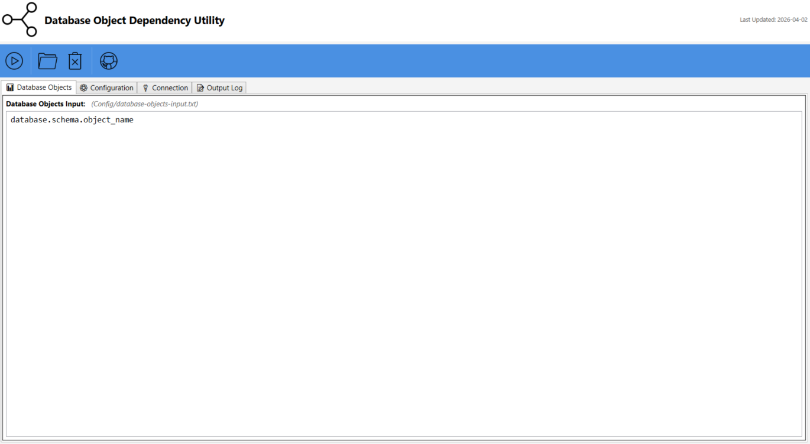

# SQL Server Database Object Dependency Utility

> 🐙 **Part of the [Advanced SQL Server Toolkit](https://github.com/smpetersgithub/Advanced_SQL_Server_Toolkit)**
> A collection of professional-grade utilities for SQL Server database management and analysis.

A comprehensive Windows desktop application for analyzing and visualizing SQL Server object dependencies with detailed Excel reporting and UI mapping capabilities.




## 📋 Overview

The SQL Server Database Object Dependency Utility is a powerful tool designed to help database administrators and developers analyze forward and reverse dependencies between SQL Server database objects. It generates comprehensive dependency reports showing what objects reference a given object (reverse dependencies) and what objects are referenced by a given object (forward dependencies), with optional UI mapping for stored procedures and views.

### Key Features

- 🔍 **Reverse Dependency Analysis** - Identify what objects reference a given object (impact analysis)
- ➡️ **Forward Dependency Analysis** - Identify what objects are referenced by a given object
- 🎯 **Multi-Object Batch Processing** - Analyze multiple objects in a single run
- 📊 **Excel Export** - Professional Excel reports with formatted dependency trees
- 🖥️ **UI Mapping** - Map stored procedures to Java UI components (DAO/UI files)
- 🌳 **Dependency Path Visualization** - Visual dependency chains with arrow notation (➡️)
- 💾 **Configuration Management** - Save and load object lists and database settings
- 🎨 **Modern WPF UI** - Clean interface with real-time logging and progress indicators
- 📝 **Detailed Logging** - Comprehensive logs for troubleshooting and auditing

## 🚀 Quick Start

### Prerequisites

- **Windows OS** (Windows 10 or later recommended)
- **Python 3.8+** with the following packages:
  - `pyodbc`
  - `pandas`
  - `openpyxl`
- **SQL Server** with appropriate permissions to query system views
- **ODBC Driver 17 for SQL Server** (or later)
- **PowerShell 5.1+** (included with Windows)
- **Java source code** (optional, for UI mapping feature)

### Installation

1. **Clone or download the repository:**
   ```bash
   cd C:\Advanced_SQL_Server_Toolkit
   git clone https://github.com/smpetersgithub/Advanced_SQL_Server_Toolkit.git
   ```

2. **Install Python dependencies:**
   ```bash
   pip install pyodbc pandas openpyxl
   ```

3. **Configure database connection:**
   - Edit `Config/database-config.json` with your SQL Server credentials

4. **Configure object list:**
   - Edit `Config/database-objects-input.txt` with objects to analyze
   - Format: `database.schema.object_name` (one per line)

5. **Launch the application:**
   - Double-click `Database Object Dependency Utility.lnk`
   - Or run: `Core\WPF\Scripts\Build\Database Object Dependency Utility.exe`

## 📖 Usage Guide

### Main Window Interface

The application features a modern WPF interface with four main tabs:

#### **📊 Database Objects Tab**
- **Database Objects Input** - Text editor for entering objects to analyze
- **Format**: `database.schema.object_name` (one per line)
- **Example**: `MyDatabase.dbo.spGetCustomerOrders`
- **Auto-saves** to `Config/database-objects-input.txt`

#### **🔌 Connection Tab**
The Connection tab manages database connectivity:

- **Database Configuration Form**:
  - **Server Name** - SQL Server instance (e.g., `localhost` or `server,port`)
  - **Database** - Database name
  - **Username** - SQL Server authentication username
  - **Password** - SQL Server authentication password (masked for security)
- **Action Buttons**:
  - **🔌 Test Connection** - Verify database connectivity before running analysis
  - **💾 Save Configuration** - Persist connection settings to `Config/database-config.json`
- **Auto-save** - Connection details are automatically saved when modified
- **Connection Status** - Real-time feedback on connection test results

#### **⚙️ Configuration Tab**
The Configuration tab provides centralized configuration file management:

- **Configuration File Selector** - Dropdown to select which config file to view/edit
  - `config.json` - Main configuration (paths, files, formatting options)
  - `database-config.json` - Database connection settings (server, credentials)
  - `cleanup-config.json` - Cleanup configuration
- **Live JSON Editor** - Edit configuration files directly in the UI
- **Auto-Save** - Changes are automatically saved after editing
- **JSON Validation** - Prevents saving invalid JSON with error messages
- **Action Buttons**:
  - **🔄 Refresh** - Reload configuration from disk (discards unsaved changes)
  - **📋 Copy Path** - Copy the full file path to clipboard
  - **💾 Save Config** - Manually save the current configuration

#### **📝 Output Log Tab**
- **Real-time logging** of all operations
- **Color-coded messages** (INFO, SUCCESS, WARNING, ERROR)
- **Detailed progress** for each analysis step
- **Error diagnostics** for troubleshooting

### Toolbar Buttons

| Icon | Button | Description |
|------|--------|-------------|
| 🔗 | **Execute Object Dependency Analysis** | Runs the complete dependency analysis pipeline for all objects in the list |
| 📁 | **Open Output Folder** | Opens the `Output` folder in Windows Explorer where all reports are saved |
| 🗑️ | **Cleanup** | Deletes all files in the Output and Logs folders after user confirmation |
| 🌐 | **View on GitHub** | Opens the project repository on GitHub in your default browser |

### Quick Start Workflow

1. **Configure Database Connection**
   - Edit `Config/database-config.json`:
     ```json
     {
       "servername": "your_server,port",
       "username": "your_username",
       "password": "your_password"
     }
     ```

2. **Add Objects to Analyze**
   - Open the **Database Objects** tab
   - Enter objects in the format: `database.schema.object_name`
   - Example:
     ```
     MyDatabase.dbo.spGetCustomerOrders
     MyDatabase.dbo.vwCustomerSummary
     MyDatabase.dbo.fnCalculateTotal
     ```

3. **Run Analysis**
   - Click **Execute Object Dependency Analysis** button
   - Watch progress in the **Output Log** tab
   - Excel report will be generated in the `Output` folder

4. **Review Results**
   - Click **Open Output Folder** to view the Excel report
   - Review dependency trees and UI mappings
   - Use for impact analysis before making changes

### Configuration Files

#### `Config/database-config.json` - Database Connection
```json
{
  "servername": "your_server,port",
  "username": "your_username",
  "password": "your_password"
}
```

#### `Config/database-objects-input.txt` - Objects to Analyze
```
database.schema.object_name
database.schema.another_object
```

**Format Rules:**
- One object per line
- Must include database, schema, and object name
- Use three-part naming: `database.schema.object_name`
- Blank lines are ignored


#### `Config/config.json` - Advanced Settings
```json
{
  "paths": {
    "java_source_dir_1": "C:\\dev\\project\\Source\\src\\main\\java",
    "java_source_dir_2": "C:\\dev\\project\\Common\\src\\main\\java",
    "project_base_dir": "C:\\Advanced_SQL_Server_Toolkit\\Database_Object_Dependency_Utility",
    "output_dir": "C:\\Advanced_SQL_Server_Toolkit\\Database_Object_Dependency_Utility\\Output",
    "log_dir": "C:\\Advanced_SQL_Server_Toolkit\\Database_Object_Dependency_Utility\\Core\\Logs"
  },
  "files": {
    "database_config": "Config\\database-config.json",
    "database_object_input": "Config\\database-objects-input.txt",
    "dependency_sql_script": "Core\\SQL\\Determine Object Dependencies.sql",
    "dependency_sql_script_reverse": "Core\\SQL\\Determine Object Dependencies Reverse.sql",
    "dependency_sql_script_forward": "Core\\SQL\\Determine Object Dependencies Forward.sql",
    "object_dependency_list_json": "object_dependency_list.json",
    "object_dependency_list_reverse_json": "object_dependency_list_reverse.json",
    "object_dependency_list_forward_json": "object_dependency_list_forward.json",
    "final_ui_mappings_csv": "UI_Mappings_Final.csv",
    "final_excel_report": "Final_Dependency_Report.xlsx",
    "final_excel_report_formatted": "Final_Dependency_Report_Formatted.xlsx"
  },
  "database": {
    "odbc_driver": "ODBC Driver 17 for SQL Server"
  },
  "formatting": {
    "naming_convention": 1,
    "part_naming_convention": 1,
    "remove_object_description": true
  }
}
```

**Configuration Options:**

**Paths:**
- `java_source_dir_1`, `java_source_dir_2` - Java source code directories for UI mapping (optional)
- `project_base_dir` - Root directory of the utility
- `output_dir` - Directory where reports are generated
- `log_dir` - Directory where log files are stored

**Formatting:**
- `naming_convention` - How object names appear in Excel reports:
  - `1` = object_name only (e.g., "spGetCustomer")
  - `2` = schema.object_name (e.g., "dbo.spGetCustomer")
  - `3` = database.schema.object_name (e.g., "MyDB.dbo.spGetCustomer")
- `part_naming_convention` - Naming convention for dependency paths (same options as above)
- `remove_object_description` - Remove object type descriptions from reports (true/false)

## 📁 Project Structure

```
Database_Object_Dependency_Utility/
├── Core/
│   ├── Python/                          # Python analysis scripts
│   │   ├── 00_run_all_scripts.py        # Master orchestration script
│   │   ├── 01_extract_complete_ui_mapping.py
│   │   ├── 02_generate_dependency_report_reverse_ui_lookup.py
│   │   ├── 03_create_final_ui_mappings.py
│   │   ├── 04_generate_dependency_report_reverse.py
│   │   ├── 05_generate_dependency_report_forward.py
│   │   ├── 06_create_final_excel_file.py
│   │   ├── 07_format_excel_file.py
│   │   ├── 08_open_excel_file.py
│   │   └── config_loader.py             # Centralized configuration loader
│   ├── SQL/                             # SQL dependency analysis scripts
│   │   ├── Determine Object Dependencies.sql
│   │   ├── Determine Object Dependencies Reverse.sql
│   │   └── Determine Object Dependencies Forward.sql
│   ├── WPF/                             # WPF UI components
│   │   ├── Assets/                      # Icons and images
│   │   └── Scripts/                     # PowerShell scripts
│   │       ├── Main.ps1                 # Main entry point
│   │       ├── MainWindow.xaml          # UI definition
│   │       ├── DatabaseObjectDependencyFunctions.ps1
│   │       └── Build/                   # Compiled EXE
│   └── Logs/                            # Application logs
├── Config/                              # Configuration files
│   ├── config.json                      # Main configuration (paths, files, formatting)
│   ├── database-config.json             # Database connection settings
│   ├── database-config-demo.json        # Example database configuration
│   ├── database-objects-input.txt       # Objects to analyze
│   ├── database-objects-input-demo.txt  # Example object list
│   └── cleanup-config.json              # Cleanup configuration
├── Output/                              # Generated reports
│   ├── Final_Dependency_Report_Formatted.xlsx
│   ├── Complete_StoredProc_to_UI_Mapping.xlsx
│   ├── Object_Dependency_List_Reverse.json
│   └── Object_Dependency_List_Forward.json
├── Database Object Dependency Utility.lnk  # Desktop shortcut
├── Sign-PowerShellScripts.ps1           # Script signing utility
├── Verify-Signatures.ps1                # Signature verification
└── README.md                            # This file
```

## 🎯 Analysis Workflow

The utility executes an 8-step analysis pipeline:

### Step 1: Extract Complete UI Mapping
- Scans Java source code directories for DAO and UI files
- Identifies stored procedure calls in Java code
- Creates mapping between stored procedures and UI components
- Outputs: `Complete_StoredProc_to_UI_Mapping.csv` and `.xlsx`
- **Optional**: Skip if UI mapping is not needed

### Step 2: Generate Reverse Dependency Report (UI Lookup)
- For each object in the input list, queries SQL Server for reverse dependencies
- Identifies all objects that reference the target object
- Performs UI lookup to find Java components that call the object
- Outputs: Initial reverse dependency data with UI mappings

### Step 3: Create Final UI Mappings
- Consolidates UI mapping data from previous steps
- Removes duplicates and formats UI component names
- Outputs: `UI_Mappings_Final.csv`

### Step 4: Generate Reverse Dependency Report
- Executes `Determine Object Dependencies Reverse.sql` for each object
- Builds complete reverse dependency chains (what references this object)
- Recursively traverses dependency tree to find all referencing objects
- Outputs: `Object_Dependency_List_Reverse.json`

### Step 5: Generate Forward Dependency Report
- Executes `Determine Object Dependencies Forward.sql` for each object
- Builds complete forward dependency chains (what this object references)
- Recursively traverses dependency tree to find all referenced objects
- Outputs: `Object_Dependency_List_Forward.json`

### Step 6: Create Final Excel File
- Combines reverse and forward dependency data
- Merges UI mapping information
- Creates structured Excel workbook with multiple sheets
- Outputs: `Final_Dependency_Report.xlsx`

### Step 7: Format Excel File
- Applies professional formatting to Excel report
- Color-codes dependency levels
- Adds filters and frozen headers
- Auto-sizes columns for readability
- Outputs: `Final_Dependency_Report_Formatted.xlsx`

### Step 8: Open Excel File
- Automatically opens the formatted Excel report
- Displays results for immediate review

## 📊 Understanding the Output

### Excel Report Structure

The final Excel report contains multiple sheets:

| Sheet | Description | Content |
|-------|-------------|---------|
| **Reverse Dependencies** | Objects that reference the target | Shows impact analysis - what will be affected if you change this object |
| **Forward Dependencies** | Objects referenced by the target | Shows what the target object depends on |
| **UI Mappings** | Java UI components that call the object | Maps stored procedures to DAO/UI files |
| **Summary** | Overview of all analyzed objects | High-level statistics and object counts |

### Dependency Path Format

Dependencies are displayed with arrow notation showing the chain:

**Reverse Dependency Example:**
```
MyApp.dbo.spGetOrders ➡️ MyApp.dbo.spProcessOrder ➡️ MyApp.dbo.spUpdateInventory
```
This shows: `spUpdateInventory` is called by `spProcessOrder`, which is called by `spGetOrders`

**Forward Dependency Example:**
```
MyApp.dbo.spProcessOrder ➡️ MyApp.dbo.fnCalculateTotal ➡️ MyApp.dbo.vwTaxRates
```
This shows: `spProcessOrder` calls `fnCalculateTotal`, which references `vwTaxRates`


### JSON Output Format

#### Reverse Dependencies JSON
```json
{
  "server_name": "MYSERVER",
  "object_name": "MyDatabase.dbo.spGetCustomerOrders",
  "object_name_path": "MyDatabase.dbo.spProcessOrders ➡️ MyDatabase.dbo.spGetCustomerOrders",
  "referenced_object_fullname": "MyDatabase.dbo.spGetCustomerOrders",
  "depth": 1,
  "object_id_path": "123456 ➡️ 789012",
  "object_type_desc_path": "SQL_STORED_PROCEDURE ➡️ SQL_STORED_PROCEDURE"
}
```

#### Forward Dependencies JSON
```json
{
  "server_name": "MYSERVER",
  "object_name": "MyDatabase.dbo.spProcessOrders",
  "object_name_path": "MyDatabase.dbo.spProcessOrders ➡️ MyDatabase.dbo.fnCalculateTotal",
  "referenced_object_fullname": "MyDatabase.dbo.fnCalculateTotal",
  "depth": 1,
  "object_id_path": "123456 ➡️ 789012",
  "object_type_desc_path": "SQL_STORED_PROCEDURE ➡️ SQL_SCALAR_FUNCTION"
}
```

**Key Fields:**
- **object_name** - The target object being analyzed
- **object_name_path** - Complete dependency chain with arrows
- **referenced_object_fullname** - The object at the end of the chain
- **depth** - Number of levels in the dependency chain
- **object_type_desc_path** - Object types in the chain

## 📈 Common Use Cases

### 1. Impact Analysis Before Making Changes
**Scenario:** You need to modify a stored procedure and want to know what will break

**Steps:**
1. Add the stored procedure to `database-objects-input.txt`
2. Run the analysis
3. Review the **Reverse Dependencies** sheet
4. Identify all objects that call this procedure
5. Plan your changes to minimize impact

**Example:**
```
Input: MyDB.dbo.spUpdateCustomer
Output: Shows 15 stored procedures and 3 UI screens that call this procedure
Action: Update all calling procedures and notify UI team
```

### 2. Refactoring Planning
**Scenario:** You want to consolidate multiple stored procedures

**Steps:**
1. Add all candidate procedures to the input list
2. Run the analysis
3. Review **Forward Dependencies** to see what each procedure uses
4. Identify common dependencies
5. Plan consolidation strategy

### 3. Database Migration
**Scenario:** Moving objects to a new database

**Steps:**
1. Add objects to migrate to the input list
2. Run the analysis
3. Review **Forward Dependencies** to identify all dependent objects
4. Ensure all dependencies are migrated together
5. Use **Reverse Dependencies** to update calling code

### 4. Security Audit
**Scenario:** Determine which objects access sensitive tables

**Steps:**
1. Add sensitive tables to the input list
2. Run the analysis
3. Review **Reverse Dependencies** to see all accessing objects
4. Audit permissions on those objects
5. Document access patterns

### 5. UI to Database Mapping
**Scenario:** Identify which UI screens use specific database objects

**Steps:**
1. Configure Java source directories in `config.json`
2. Add database objects to the input list
3. Run the analysis
4. Review **UI Mappings** sheet
5. Document UI dependencies for change management

## 🔧 Advanced Configuration

### Configuration Format (JSON)

This utility uses **JSON format** for configuration files, providing better structure and type safety. All configuration is managed through:

- **`config.json`** - Main configuration (paths, files, formatting)
- **`database-config.json`** - Database connection settings
- **`config_loader.py`** - Centralized configuration loader class

**Benefits of JSON Configuration:**
- ✅ Structured nested objects
- ✅ Type-safe getter methods in `config_loader.py`
- ✅ Better validation and error handling
- ✅ Consistent across all utilities in the toolkit
- ✅ Easy to edit in the WPF UI with auto-save

### UI Mapping Configuration

To enable UI mapping, configure Java source directories in `config.json`:

```json
{
  "paths": {
    "java_source_dir_1": "C:\\dev\\project\\Source\\src\\main\\java",
    "java_source_dir_2": "C:\\dev\\project\\Common\\src\\main\\java"
  }
}
```

The utility will scan these directories for:
- **DAO files** - Data Access Objects that call stored procedures
- **UI files** - User interface components that use DAOs
- **Stored procedure calls** - Direct SQL calls in Java code

### Naming Convention Options

Control how object names appear in Excel reports in `config.json`:

```json
{
  "formatting": {
    "naming_convention": 1
  }
}
```

**Option 1** - Object name only:
```
spGetCustomer
```

**Option 2** - Schema.Object:
```
dbo.spGetCustomer
```

**Option 3** - Database.Schema.Object:
```
MyDatabase.dbo.spGetCustomer
```

### Batch Processing Multiple Objects

Add multiple objects to analyze in one run:

```
# Config/database-objects-input.txt
MyDB.dbo.spGetCustomerOrders
MyDB.dbo.spProcessPayment
MyDB.dbo.spUpdateInventory
MyDB.dbo.vwCustomerSummary
MyDB.dbo.fnCalculateTotal
```

The utility will analyze all objects and combine results into a single Excel report.

## 🛠️ Troubleshooting

### Common Issues

**Issue: No dependencies found**
- **Solution**: Verify the object exists in the database
  ```sql
  -- Check if object exists
  SELECT * FROM sys.objects
  WHERE OBJECT_ID = OBJECT_ID('database.schema.object_name');

  -- Check for dependencies
  SELECT * FROM sys.sql_expression_dependencies
  WHERE referenced_id = OBJECT_ID('database.schema.object_name');
  ```

**Issue: Python script fails with pyodbc error**
- **Solution**: Verify ODBC driver is installed
  ```bash
  # Check installed ODBC drivers
  python -c "import pyodbc; print(pyodbc.drivers())"

  # Install ODBC Driver 17 for SQL Server
  # Download from: https://docs.microsoft.com/en-us/sql/connect/odbc/download-odbc-driver-for-sql-server
  ```

**Issue: Connection timeout**
- **Solution**: Check server name and port in `database-config.json`
  ```json
  {
    "servername": "servername,port",  // Ensure port is correct
    "username": "your_username",
    "password": "your_password"
  }
  ```

**Issue: UI mapping not working**
- **Solution**: Verify Java source directories exist
  - Check paths in `config.json` under `paths` section
  - Ensure directories contain `.java` files
  - Verify DAO files contain stored procedure calls


**Issue: Excel file won't open**
- **Solution**: Check that Microsoft Excel is installed
  - Verify Output folder permissions
  - Close any open Excel files with the same name
  - Check for antivirus blocking file access

**Issue: Incomplete dependency chains**
- **Solution**: Verify SQL Server permissions
  ```sql
  -- Required permissions
  GRANT VIEW DEFINITION ON DATABASE::YourDatabase TO YourUser;
  GRANT SELECT ON sys.sql_expression_dependencies TO YourUser;
  GRANT SELECT ON sys.objects TO YourUser;
  ```

### Log Files

All operations are logged to `Core/Logs/`:
- `log_01_extract_complete_ui_mapping_*.log` - UI mapping extraction
- `log_02_generate_dependency_report_reverse_ui_lookup_*.log` - Reverse dependencies with UI lookup
- `log_03_create_final_ui_mappings_*.log` - UI mapping consolidation
- `log_04_generate_dependency_report_reverse_*.log` - Reverse dependency analysis
- `log_05_generate_dependency_report_forward_*.log` - Forward dependency analysis
- `log_06_create_final_excel_file_*.log` - Excel file creation
- `log_07_format_excel_file_*.log` - Excel formatting
- `log_08_open_excel_file_*.log` - Excel file opening

## 🎓 Best Practices

### Before Running Analysis
1. **Verify database connectivity** - Test connection to SQL Server
2. **Check permissions** - Ensure user has VIEW DEFINITION rights
3. **Review object list** - Verify all objects exist in the database
4. **Backup configurations** - Save current settings before making changes

### During Analysis
1. **Monitor logs** - Watch the Output Log tab for errors
2. **Be patient** - Large dependency trees may take several minutes
3. **Don't close the window** - Let the analysis complete fully

### After Analysis
1. **Review Excel report** - Check all sheets for completeness
2. **Validate dependencies** - Spot-check critical dependencies
3. **Document findings** - Save reports for future reference
4. **Plan changes carefully** - Use reverse dependencies for impact analysis

### Performance Tips
- Analyze objects in batches of 10-20 for faster processing
- Disable UI mapping if not needed (faster analysis)
- Run during off-peak hours for large databases
- Clean up old output files regularly to save disk space

## 🎯 SQL Server Permissions Required

The utility requires the following SQL Server permissions:

```sql
-- Grant VIEW DEFINITION on the database
GRANT VIEW DEFINITION ON DATABASE::YourDatabase TO YourUser;

-- Grant SELECT on system views
GRANT SELECT ON sys.sql_expression_dependencies TO YourUser;
GRANT SELECT ON sys.objects TO YourUser;
GRANT SELECT ON sys.schemas TO YourUser;
GRANT SELECT ON sys.databases TO YourUser;

-- For cross-database dependencies
GRANT VIEW ANY DATABASE TO YourUser;
```

## 🤝 Contributing

Contributions are welcome! Please feel free to submit a Pull Request.

### Development Setup

1. Fork the repository
2. Create a feature branch: `git checkout -b feature/my-feature`
3. Make your changes
4. Test thoroughly with different SQL Server databases
5. Commit: `git commit -am 'Add new feature'`
6. Push: `git push origin feature/my-feature`
7. Submit a Pull Request

## 📝 License

This project is licensed under the MIT License - see the LICENSE file for details.

## 👤 Author

**Scott Peters**
- Website: https://advancedsqlpuzzles.com
- GitHub: [@smpetersgithub](https://github.com/smpetersgithub)

## 🙏 Acknowledgments

- Icons provided by [Icons8](https://icons8.com)
- Built with Python, PowerShell, and WPF
- Uses pyodbc, pandas, and openpyxl libraries
- Inspired by SQL Server dependency analysis needs

## 📞 Support

For issues, questions, or suggestions:
- Open an issue on [GitHub Issues](https://github.com/smpetersgithub/Advanced_SQL_Server_Toolkit/issues)
- Check existing issues for solutions
- Review the logs in `Core/Logs/` for detailed error information

---

**Made with ❤️ for SQL Server DBAs and Database Developers**
