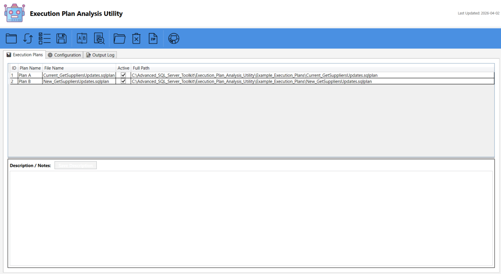

# SQL Server Execution Plan Analysis Utility

A comprehensive Windows desktop application for analyzing and comparing SQL Server execution plans with detailed Excel reporting and visual insights.


## 📋 Overview

The SQL Server Execution Plan Analysis Utility is a powerful tool designed to help database administrators and developers analyze SQL Server execution plans (.sqlplan files) with ease. It provides detailed comparisons, identifies performance bottlenecks, and generates comprehensive Excel reports with color-coded insights.



### Key Features

- 🔍 **Compare Execution Plans** - Side-by-side comparison of two execution plans
- 📊 **Individual Plan Analysis** - Detailed analysis of single execution plans
- 📈 **Excel Export** - Professional Excel reports with color-coded tabs and formatting
- 🎯 **Cardinality Estimation Warnings** - Automatic highlighting of 10x estimation errors
- 🗂️ **Configuration Management** - Save and load plan configurations
- 🔄 **Batch Processing** - Analyze multiple plans at once
- 💾 **Backup & Restore** - Configuration backup and restore functionality
- 🎨 **Modern UI** - Clean WPF interface with intuitive controls

## 🚀 Quick Start

### Prerequisites

- **Windows OS** (Windows 10 or later recommended)
- **Python 3.8+** with the following packages:
  - `pandas`
  - `openpyxl`
  - `lxml`
- **PowerShell 5.1+** (included with Windows)

### Installation

1. **Clone the repository:**
   ```bash
   git clone https://github.com/smpetersgithub/SQL-Server-Execution-Plan-Analysis-Utility.git
   cd SQL-Server-Execution-Plan-Analysis-Utility
   ```

2. **Install Python dependencies:**
   ```bash
   pip install pandas openpyxl lxml
   ```

3. **Launch the application:**
   - Double-click `Execution Plan Analysis Utility.lnk`
   - Or run: `Core\WPF\Scripts\Build\Execution Plan Analysis Utility.exe`

## 📖 Usage Guide

### Toolbar Buttons

The application toolbar is organized into three sections:

#### **Configuration Management**

| Icon | Button | Description |
|------|--------|-------------|
|  | **Load Execution Plans** | Opens a folder browser to select a directory containing `.sqlplan` files. All plans in the folder will be loaded into the grid. |
|  | **Reload Directory** | Checks the current directory for new `.sqlplan` files and adds them to the grid without removing existing plans. |
|  | **Load Configuration** | Loads a previously saved configuration JSON file to restore plan names, descriptions, and active states. |
|  | **Save Configuration** | Saves the current plan configuration (names, descriptions, active states) to a JSON file for later use. |

#### **Analysis**

| Icon | Button | Description |
|------|--------|-------------|
|  | **Compare Execution Plans** | Compares exactly 2 active plans side-by-side and generates a detailed Excel comparison report with 8 sheets. |
|  | **Analyze Individual Plans** | Analyzes each active plan individually and generates separate Excel summary reports for each plan. |

#### **File Management**

| Icon | Button | Description |
|------|--------|-------------|
|  | **Open Output Folder** | Opens the `Output` folder in Windows Explorer where all generated Excel reports are saved. |
|  | **Cleanup** | Deletes all files in the `Output` and `Logs` folders after user confirmation. |
|  | **Backup Configurations** | Creates a timestamped ZIP backup of all configuration files in the `Config` folder. |

#### **Help**

| Icon | Button | Description |
|------|--------|-------------|
|  | **View on GitHub** | Opens the project repository on GitHub in your default browser. |

### Quick Start Workflow

#### **Comparing Two Plans**

1. Click  **Load Execution Plans** and select a folder with `.sqlplan` files
2. Edit plan names and descriptions in the grid as needed
3. Check the **Active** checkbox for exactly **2 plans**
4. Click  **Compare Execution Plans**
5. The Excel comparison report will automatically open

#### **Analyzing Individual Plans**

1. Click  **Load Execution Plans** and select a folder with `.sqlplan` files
2. Edit plan names and descriptions in the grid as needed
3. Check the **Active** checkbox for **1 or more plans**
4. Click  **Analyze Individual Plans**
5. Individual Excel reports will be generated for each active plan

### Excel Report Structure

#### Comparison Report (`Compare.*.xlsx`)

| Sheet | Description | Tab Color |
|-------|-------------|-----------|
| **Summary** | Metric-by-metric comparison | Default |
| **Stmts-Plan1** | Statement breakdown for Plan 1 | 🔴 Light Red |
| **Stmts-Plan2** | Statement breakdown for Plan 2 | 🔴 Light Red |
| **Dtl-Plan1** | Node-level details for Plan 1 | 🔵 Light Blue |
| **Dtl-Plan2** | Node-level details for Plan 2 | 🔵 Light Blue |
| **Missing Indexes** | Index recommendations | Default |
| **Warnings** | Plan warnings and issues | Default |
| **Plan Overview** | High-level plan summary | Default |

#### Individual Plan Report (`Summary.*.xlsx`)

| Sheet | Description |
|-------|-------------|
| **Summary** | Plan metrics summary |
| **Plan Overview** | High-level plan information |
| **Statements** | Detailed statement breakdown |
| **Details** | Operator-level details |
| **Missing Indexes** | Index recommendations |
| **Warnings** | Plan warnings and issues |

### Key Excel Features

- ✅ **Color-Coded Tabs** - Statements (red) and Details (blue) for easy navigation
- ✅ **10x Rule Highlighting** - Automatic highlighting of cardinality estimation errors
- ✅ **Auto-Filters** - All sheets have filters enabled
- ✅ **Frozen Headers** - Top row frozen for easy scrolling
- ✅ **Auto-Sized Columns** - Columns automatically sized for readability
- ✅ **Table/Index Name Extraction** - Clean table/index names extracted from full paths

## 📁 Project Structure

```
SQL-Server-Execution-Plan-Analysis-Utility/
├── Core/
│   ├── Python/                          # Python analysis scripts
│   │   ├── 001_analyze_execution_plans.py
│   │   ├── 002_export_to_excel.py
│   │   ├── 003_analyze_single_plan.py
│   │   ├── 004_export_single_plan_to_excel.py
│   │   └── config.ini
│   ├── WPF/                             # WPF UI components
│   │   ├── Assets/                      # Icons and images
│   │   └── Scripts/                     # PowerShell scripts
│   │       ├── Main.ps1
│   │       ├── MainWindow.xaml
│   │       ├── ExecutionPlanAnalysisFunctions.ps1
│   │       └── Build/                   # Compiled EXE
│   └── Logs/                            # Application logs
├── Config/                              # Configuration files
├── Output/                              # Generated reports
├── Example_Execution_Plans/             # Sample plans (optional)
└── README.md
```

## 🔧 Configuration

The utility uses `Core/Python/config.ini` for configuration:

- **Paths** - Directory locations (logs, output, config)
- **Files** - Output file naming conventions
- **Logging** - Log format, level, and timestamp format
- **Excel** - Header colors, font settings, sheet name length

## 🎯 Advanced Features

### Cardinality Estimation Analysis

The utility automatically highlights rows where:
- Estimated rows vs. actual rows differ by **10x or more**
- At least one value is **greater than 200 rows**

This helps identify query optimizer estimation issues that can lead to poor performance.

### Configuration Management

- **Save Configuration** - Save current plan setup to JSON
- **Load Configuration** - Restore previously saved configurations
- **Backup Configurations** - Create timestamped ZIP backups

### Cleanup & Maintenance

- **Cleanup** - Delete all files in Output and Logs folders
- **Refresh** - Reload execution plans from the current directory
- **Open Output Folder** - Quick access to generated reports

## 📊 Metrics Analyzed

The utility extracts and analyzes the following metrics from execution plans:

### Plan-Level Metrics
- Total Execution Time (ms)
- Total CPU Time (ms)
- Total Elapsed Time (ms)
- Compilation Time (ms)
- Query Cost
- Number of Statements
- Degree of Parallelism

### Statement-Level Metrics
- Statement Cost
- Statement Subtree Cost
- Estimated Rows
- Actual Rows
- Estimated Executions
- Actual Executions
- CPU Time
- Elapsed Time

### Operator-Level Metrics
- Node Type (e.g., Index Seek, Table Scan, Hash Join)
- Physical Operation
- Logical Operation
- Estimated Cost
- Estimated CPU Cost
- Estimated I/O Cost
- Estimated Rows
- Actual Rows
- Actual Executions
- Actual Rebinds
- Actual Rewinds
- Parallel Execution Flag
- Warnings

### Additional Analysis
- **Missing Indexes** - Index recommendations from the query optimizer
- **Warnings** - Plan warnings (e.g., missing statistics, implicit conversions)
- **Table/Index Usage** - Tables and indexes accessed by the query
- **Seek/Scan Predicates** - Filter conditions used in operations
- **Output Lists** - Columns returned by each operator

## 🛠️ Troubleshooting

### Common Issues

**Issue: Python scripts fail to run**
- Ensure Python 3.8+ is installed and in PATH
- Install required packages: `pip install pandas openpyxl lxml`

**Issue: Excel files won't open**
- Check that Microsoft Excel is installed
- Verify Output folder permissions
- Close any open Excel files with the same name

**Issue: No plans appear after loading**
- Ensure the folder contains `.sqlplan` files
- Check file permissions
- Review logs in `Core/Logs/` for errors

**Issue: Comparison fails**
- Verify exactly 2 plans are marked as Active
- Ensure both .sqlplan files are valid
- Check logs for detailed error messages

### Log Files

All operations are logged to `Core/Logs/`:
- `log_001_analyze_execution_plans_*.log` - Comparison analysis
- `log_002_export_to_excel_*.log` - Comparison Excel export
- `log_003_analyze_single_plan_*.log` - Individual plan analysis
- `log_004_export_single_plan_to_excel_*.log` - Individual plan Excel export

## 🤝 Contributing

Contributions are welcome! Please feel free to submit a Pull Request.

### Development Setup

1. Fork the repository
2. Create a feature branch: `git checkout -b feature/my-feature`
3. Make your changes
4. Test thoroughly
5. Commit: `git commit -am 'Add new feature'`
6. Push: `git push origin feature/my-feature`
7. Submit a Pull Request

## 📝 License

This project is licensed under the MIT License - see the LICENSE file for details.

## 👤 Author

**Scott Peters**
- GitHub: [@smpetersgithub](https://github.com/smpetersgithub)

## 🙏 Acknowledgments

- Icons provided by [Icons8](https://icons8.com)
- Built with Python, PowerShell, and WPF
- Uses pandas, openpyxl, and lxml libraries

## 📞 Support

For issues, questions, or suggestions:
- Open an issue on [GitHub Issues](https://github.com/smpetersgithub/SQL-Server-Execution-Plan-Analysis-Utility/issues)
- Check existing issues for solutions
- Review the logs in `Core/Logs/` for detailed error information

## 🔄 Version History

### Version 1.0 (2025-12-22)
- Initial release
- Execution plan comparison
- Individual plan analysis
- Excel export with color-coded tabs
- Cardinality estimation highlighting
- Configuration management
- Backup and restore functionality
- Modern WPF UI

---

**Made with ❤️ for SQL Server DBAs and Developers**

