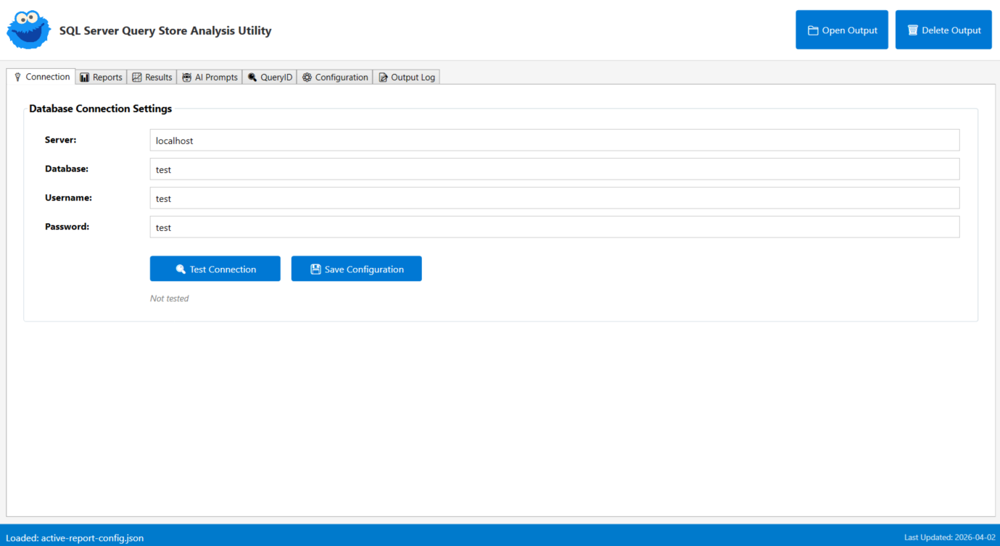

# SQL Server Query Store Analysis Utility

> 🐙 **Part of the [Advanced SQL Server Toolkit](https://github.com/smpetersgithub/Advanced_SQL_Server_Toolkit)**
> A collection of professional-grade utilities for SQL Server database management and analysis.

A comprehensive Python-based toolkit for analyzing SQL Server Query Store data, extracting execution plans, and generating AI-ready performance analysis reports.




## 📋 Overview

The SQL Server Query Store Analysis Utility automates the extraction and analysis of Query Store data from SQL Server databases. It provides multiple pre-configured reports for different performance analysis scenarios, extracts execution plans, and converts them to AI-ready JSON format for detailed performance tuning recommendations.

### Key Features

- 🎨 **Modern WPF UI** - Professional Windows interface with tabbed navigation and real-time feedback
- 📊 **Multiple Analysis Reports** - 6 pre-configured Query Store analysis reports
- 🔍 **Execution Plan Extraction** - Automatic XML execution plan download and parsing
- 🤖 **AI-Ready Output** - Structured JSON format optimized for AI analysis
- 📈 **Index & Statistics Analysis** - Automatic extraction of index and statistics metadata
- 🎯 **Smart Table Filtering** - Only analyzes tables referenced in execution plans
- 🔄 **Plan Regression Detection** - Identifies queries with multiple execution plans
- 💾 **Configurable Reports** - Easy report selection via JSON configuration
- 🔌 **Connection Management** - Built-in connection testing and configuration
- 📝 **AI Analysis Prompts** - Pre-built prompts for AI-powered performance analysis
- ⚙️ **Configuration Management** - In-app configuration file editing with refresh capability

## 🚀 Quick Start

### Prerequisites

- **Windows OS** (Windows 10 or later recommended)
- **Python 3.8+** with the following packages:
  - `pyodbc`
- **SQL Server** with Query Store enabled
- **ODBC Driver 17 for SQL Server** (or later)
- **PowerShell 5.1+** (included with Windows)

### Installation

1. **Clone or download the repository:**
   ```bash
   cd C:\Advanced_SQL_Server_Toolkit
   git clone https://github.com/smpetersgithub/Advanced_SQL_Server_Toolkit.git
   ```

2. **Install Python dependencies:**
   ```bash
   pip install pyodbc
   ```

3. **Enable Query Store on your SQL Server database:**
   ```sql
   ALTER DATABASE [YourDatabase] SET QUERY_STORE = ON;
   ```

4. **Configure database connection:**
   - Edit `Config/database-config.json` with your SQL Server credentials

5. **Launch the application:**
   - Double-click `Query Store Analysis Utility.lnk`
   - Or run: `python cli.py`

## 📖 Usage Guide

### Modern WPF User Interface

The utility features a modern Windows Presentation Foundation (WPF) interface with multiple tabs for different operations:

#### **🔌 Connection Tab**
- **Database Configuration** - Server, database, username, and password fields
- **Test Connection** - Verify database connectivity before running analysis
- **Save Configuration** - Persist connection settings to `Config/database-config.json`
- **Auto-save** - Connection details are automatically saved when modified

#### **📊 Reports Tab**
- **Report Selection** - Choose from 6 pre-configured Query Store analysis reports
- **Report Configuration** - View and modify report-specific settings (top N queries, execution plans, etc.)
- **Execute Report** - Run the selected report analysis
- **Save Report Settings** - Persist report configuration changes
- **Real-time Status** - Progress indicators and status messages during execution

#### **📈 Results Tab**
- **Query Results Grid** - View analysis results in a sortable, filterable data grid
- **Export Options** - Export results to CSV or Excel
- **Execution Plan Links** - Direct links to execution plan files
- **Performance Metrics** - CPU time, logical reads, execution count, and more

#### **🤖 AI Prompts Tab**
- **Prompt Library** - Pre-built AI analysis prompts for different scenarios
- **Prompt Editor** - View and customize AI prompts
- **Copy to Clipboard** - Quick copy for use with AI tools
- **Prompt Management** - Load and save custom prompts

#### **🔍 QueryID Tab**
- **Query Lookup** - Search for specific queries by Query ID
- **Query Details** - View query text, execution plans, and statistics
- **Plan History** - See all execution plans for a query
- **Performance Trends** - Historical performance data

#### **⚙️ Configuration Tab**
- **Configuration File Selector** - Dropdown to select which config file to view/edit
  - `config.json` - Main configuration (paths, processing settings)
  - `database-config.json` - Database connection settings
  - `reports-config.json` - Report definitions and settings
  - `active-report.json` - Currently selected report
- **Configuration Editor** - View and edit JSON configuration files
- **Action Buttons**:
  - **🔄 Refresh** - Reload configuration from disk
  - **📋 Copy Path** - Copy the full file path to clipboard
  - **💾 Save Config** - Manually save the current configuration

#### **📝 Output Log Tab**
- **Real-time Logging** - Timestamped log messages for all operations
- **Operation Tracking** - Monitor database connections, report execution, and exports
- **Error Diagnostics** - Detailed error messages for troubleshooting
- **Clear Log Button** - Clear all log messages with one click
- **Auto-Scroll** - Automatically scrolls to the latest message

---

## 📊 Available Reports

The utility includes 3 pre-configured Query Store analysis reports:

| Report | Description | Use Case |
|--------|-------------|----------|
| **Top Resource Consuming Queries** | Queries ranked by total logical reads | Identify most expensive queries |
| **Queries with High Variation** | Queries with inconsistent performance | Detect parameter sniffing issues |
| **Queries with High Plan Count** | Queries with multiple execution plans | Identify plan instability |

**Note:** Additional reports (Regressed Queries, Query Wait Statistics, Overall Resource Consumption) are configured but require SQL query files to be created in `Core/SQL/`.

### Configuration Files

All Python scripts use a centralized `ConfigLoader` class (`Core/Python/config_loader.py`) for type-safe configuration management. This ensures consistent configuration handling across all scripts.

#### `Config/database-config.json` - Database Connection
```json
{
  "servername": "your_server,port",
  "database": "your_database",
  "username": "your_username",
  "password": "your_password"
}
```

#### `Config/active-report.json` - Active Report Selection
```json
{
  "active_report": "top_resource_consuming_queries"
}
```

**Available report keys:**
- `top_resource_consuming_queries` (SQL file exists)
- `queries_with_high_variation` (SQL file exists)
- `queries_with_high_plan_count` (SQL file exists)
- `regressed_queries` (configured, SQL file needed)
- `query_wait_statistics` (configured, SQL file needed)
- `overall_resource_consumption` (configured, SQL file needed)

#### `Config/reports-config.json` - Report Definitions
Contains detailed configuration for each report including:
- SQL query files
- Output directories
- Analysis options (execution plans, indexes, statistics)
- Top N query limits


#### `Config/config.json` - Python Script Settings
```json
{
  "paths": {
    "logs": {
      "base_dir": "Logs"
    },
    "config": {
      "database_config": "Config/database-config.json",
      "reports_config": "Config/reports-config.json",
      "active_report_config": "Config/active-report.json"
    }
  },
  "processing": {
    "xml_plan_download_batch_size": 5,
    "sql_fetch_batch_size": 1000
  }
}
```

## 📁 Project Structure

```
Query_Store_Analysis_Utility/
├── Core/
│   ├── Python/                          # Python analysis scripts
│   │   ├── run_all_scripts.py           # Master orchestration script
│   │   ├── 01_extract_query_store_data.py
│   │   ├── 02_extract_xml_execution_plans.py
│   │   ├── 03_extract_table_names_from_xml_plans.py
│   │   ├── 04_extract_index_and_statistics_for_tables.py
│   │   ├── 05_create_json_execution_plans.py
│   │   ├── 06_lookup_query_by_id.py     # Query lookup utility
│   │   └── config_loader.py             # Centralized configuration loader
│   ├── SQL/                             # SQL query files
│   │   ├── Query Store Top Resource Consuming Queries.sql
│   │   ├── Query Store Queries With High Variation.sql
│   │   ├── Query Store Queries With High Plan Count.sql
│   │   ├── Index Detail.sql
│   │   └── Statistics Detail.sql
│   ├── WPF/                             # WPF UI components (future)
│   └── Logs/                            # Application logs
├── Config/                              # Configuration files
│   ├── database-config.json             # Database connection settings
│   ├── active-report.json               # Active report selection
│   ├── reports-config.json              # Report definitions
│   └── config.json                      # Python script settings
├── Output/                              # Generated reports (organized by report type)
│   ├── Top_Resource_Consuming_Queries/
│   │   ├── top_resource_consuming_queries.json
│   │   ├── XML_Execution_Plans/         # Raw .sqlplan files
│   │   ├── json_execution_plans/        # Parsed JSON execution plans
│   │   ├── table_names_from_plans.json
│   │   ├── index_details.json
│   │   ├── statistics_details.json
│   │   └── Analysis/                    # AI-generated analysis reports
│   ├── Regressed_Queries/
│   ├── Queries_With_High_Variation/
│   ├── Queries_With_High_Plan_Count/
│   ├── Query_Wait_Statistics/
│   └── Overall_Resource_Consumption/
├── AI_Prompt/                           # AI analysis prompts
│   ├── Top_Resource_Consuming_Queries_Prompt.md
│   ├── Queries_With_High_Plan_Count_Prompt.md
│   └── Queries_With_High_Variation_Prompt.md
├── cli.py                               # Interactive command-line interface
├── Query Store Analysis Utility.lnk    # Desktop shortcut
├── Sign-PowerShellScripts.ps1           # Script signing utility
├── Verify-Signatures.ps1                # Signature verification
└── README.md                            # This file
```

## 🎯 Analysis Workflow

The utility executes a 5-step analysis pipeline:

### Step 1: Extract Query Store Data
- Connects to SQL Server
- Executes the active report's SQL query
- Saves results to JSON (e.g., `top_resource_consuming_queries.json`)
- Includes query IDs, plan IDs, execution counts, resource metrics

### Step 2: Extract XML Execution Plans (Optional)
- Downloads XML execution plans (.sqlplan files) for each query
- Uses batching (5 plans at a time) to prevent connection timeouts
- Saves to `XML_Execution_Plans/` directory
- Skips if `include_execution_plans` is disabled in report config

### Step 3: Extract Table Names from Plans (Optional)
- Parses XML execution plans to identify referenced tables
- Extracts schema-qualified table names
- Saves to `table_names_from_plans.json`
- Enables targeted index/statistics analysis

### Step 4: Extract Index and Statistics Metadata (Optional)
- Queries SQL Server for index details (seeks, scans, updates, size)
- Queries SQL Server for statistics details (last update, modification count)
- Only analyzes tables referenced in execution plans
- Saves to `index_details.json` and `statistics_details.json`
- Skips if `analyze_indexes` is disabled in report config

### Step 5: Create JSON Execution Plans (Optional)
- Converts XML execution plans to structured JSON
- Extracts operators, costs, row estimates, warnings
- Optimized format for AI analysis
- Saves to `json_execution_plans/` directory
- File naming: `<ObjectName>_QueryID_[id]_PlanID_[id].json`

## 🤖 AI-Powered Analysis

The utility generates AI-ready output for performance tuning recommendations.

### Using the AI Analysis Prompts

1. **Run the analysis pipeline** using the CLI or `python Core/Python/run_all_scripts.py`

2. **Open the appropriate AI prompt** from the `AI_Prompt/` directory:
   - `Top_Resource_Consuming_Queries_Prompt.md` - For top resource queries
   - `Queries_With_High_Plan_Count_Prompt.md` - For plan instability
   - `Queries_With_High_Variation_Prompt.md` - For parameter sniffing

3. **Attach the output files** to your AI chat:
   - `@Output/<ReportType>/<report_name>.json` - Main query results
   - `@Output/<ReportType>/json_execution_plans/` - Execution plans
   - `@Output/<ReportType>/index_details.json` - Index metadata
   - `@Output/<ReportType>/statistics_details.json` - Statistics metadata

4. **Copy and paste the AI prompt** into your AI chat

5. **Save the analysis** to `Output/<ReportType>/Analysis/` directory
   - Filename pattern: `<ObjectName>_QueryID_[id]_Analysis.md`

### AI Analysis Capabilities

The AI can help you:
- ✅ Identify missing indexes with high impact (>50% improvement)
- ✅ Detect stale statistics that need updating
- ✅ Find unused indexes (candidates for removal)
- ✅ Analyze plan regression (compare multiple plans for same query)
- ✅ Identify parameter sniffing issues
- ✅ Recommend query rewrites and optimizations
- ✅ Detect implicit conversions and other warnings
- ✅ Analyze seek vs. scan ratios for index effectiveness


## 📊 Understanding the Output

### Query Store Data JSON

Each report generates a main JSON file with query metrics:

```json
{
  "myRank": 1,
  "server_name": "MYSERVER",
  "database_name": "MyDatabase",
  "object_name": "spMyStoredProc",
  "query_id": 1181,
  "plan_ids": "1117,12762",
  "plan_count": 2,
  "total_executions": 15234,
  "total_cpu_ms": 45678.90,
  "total_duration_ms": 56789.12,
  "total_logical_reads": 123456789,
  "avg_logical_reads": 8102.45,
  "first_execution_time": "2024-01-01 08:00:00",
  "last_execution_time": "2024-03-09 15:30:00",
  "sql_text_10000": "SELECT * FROM..."
}
```

**Key Fields:**
- **query_id** - Unique identifier for the query
- **plan_ids** - Comma-separated list of plan IDs (multiple = plan instability)
- **plan_count** - Number of different execution plans
- **total_logical_reads** - Primary performance metric (higher = more expensive)

### Execution Plan JSON

Structured JSON format for each execution plan:

```json
{
  "query_id": 1181,
  "plan_id": 1117,
  "object_name": "spMyStoredProc",
  "plan_summary": {
    "total_cost": 45.67,
    "compilation_time_ms": 12.34,
    "degree_of_parallelism": 4
  },
  "operators": [
    {
      "node_id": 0,
      "physical_operation": "Index Seek",
      "logical_operation": "Clustered Index Seek",
      "estimated_rows": 1000,
      "actual_rows": 950,
      "estimated_cpu_cost": 0.0001234,
      "estimated_io_cost": 0.003125,
      "table_name": "dbo.MyTable",
      "index_name": "PK_MyTable"
    }
  ],
  "missing_indexes": [...],
  "warnings": [...]
}
```

### Index Details JSON

Index usage statistics for tables referenced in plans:

```json
{
  "table_name": "dbo.MyTable",
  "index_name": "IX_MyTable_Column1",
  "index_type": "NONCLUSTERED",
  "user_seeks": 12345,
  "user_scans": 67,
  "user_updates": 890,
  "size_mb": 45.67,
  "last_user_seek": "2024-03-09 15:30:00"
}
```

### Statistics Details JSON

Statistics metadata for tables:

```json
{
  "table_name": "dbo.MyTable",
  "stats_name": "IX_MyTable_Column1",
  "last_updated": "2024-02-15 10:00:00",
  "rows": 1000000,
  "rows_sampled": 1000000,
  "modification_counter": 45678,
  "persisted_sample_percent": 100.0
}
```

## 🔧 Advanced Configuration

### Customizing Report Settings

Edit `Config/reports-config.json` to customize each report:

```json
{
  "reports": {
    "top_resource_consuming_queries": {
      "name": "Top Resource Consuming Queries",
      "enabled": true,
      "sql_files": {
        "main_query": "Core/SQL/Query Store Top Resource Consuming Queries.sql"
      },
      "output": {
        "base_dir": "Output/Top_Resource_Consuming_Queries",
        "main_results_json": "top_resource_consuming_queries.json"
      },
      "analysis_options": {
        "include_execution_plans": true,
        "analyze_indexes": true,
        "top_n_queries": 10
      }
    }
  }
}
```

**Configuration Options:**
- **enabled** - Enable/disable the report
- **include_execution_plans** - Download and parse execution plans
- **analyze_indexes** - Extract index and statistics metadata
- **top_n_queries** - Number of queries to analyze (default: 10)

### Customizing SQL Queries

You can modify the SQL queries in `Core/SQL/` to customize the analysis:

**Example: Change top N queries**
```sql
-- In Query Store Top Resource Consuming Queries.sql
DECLARE @top_n_queries INT = 20;  -- Change from 10 to 20
```

**Example: Add date filter**
```sql
WHERE qrs.last_execution_time >= DATEADD(day, -7, GETDATE())
```

## 🛠️ Troubleshooting

### Common Issues

**Issue: Query Store has no data**
- **Solution**: Ensure Query Store is enabled and has captured data
  ```sql
  -- Check Query Store status
  SELECT * FROM sys.database_query_store_options;

  -- Enable Query Store
  ALTER DATABASE [YourDatabase] SET QUERY_STORE = ON;

  -- Verify data exists
  SELECT COUNT(*) FROM sys.query_store_query;
  ```

**Issue: Connection timeout when downloading execution plans**
- **Solution**: Reduce batch size in `Config/config.json`
  ```json
  "processing": {
    "xml_plan_download_batch_size": 3  // Reduce from 5 to 3
  }
  ```

**Issue: Python script fails with pyodbc error**
- **Solution**: Verify ODBC driver is installed
  ```bash
  # Check installed ODBC drivers
  python -c "import pyodbc; print(pyodbc.drivers())"

  # Install ODBC Driver 17 for SQL Server
  # Download from: https://docs.microsoft.com/en-us/sql/connect/odbc/download-odbc-driver-for-sql-server
  ```

**Issue: No tables found in execution plans**
- **Solution**: Ensure execution plans contain table references
  - Some queries (e.g., SELECT @@VERSION) don't reference tables
  - Check `XML_Execution_Plans/` directory for .sqlplan files
  - Verify plans contain `<Object>` elements

**Issue: AI analysis not working**
- **Solution**: Verify output files exist and are valid JSON
  ```bash
  # Check if files exist
  dir Output\Top_Resource_Consuming_Queries\*.json

  # Validate JSON syntax
  python -m json.tool Output\Top_Resource_Consuming_Queries\top_resource_consuming_queries.json
  ```


### Log Files

All operations are logged to `Core/Logs/`:
- `log_01_extract_query_store_data_*.log` - Query Store data extraction
- `log_02_extract_xml_execution_plans_*.log` - XML plan download
- `log_03_extract_table_names_from_xml_plans_*.log` - Table name extraction
- `log_04_extract_index_and_statistics_for_tables_*.log` - Index/statistics extraction
- `log_05_create_json_execution_plans_*.log` - JSON plan conversion

## 📈 Common Use Cases

### 1. Identify Top Resource-Consuming Queries
**Report:** Top Resource Consuming Queries

**Goal:** Find the most expensive queries by logical reads

**Steps:**
1. Set active report to `top_resource_consuming_queries`
2. Run analysis
3. Review `top_resource_consuming_queries.json`
4. Use AI prompt to get tuning recommendations

### 2. Detect Plan Regression
**Report:** Queries with High Plan Count

**Goal:** Find queries with multiple execution plans (plan instability)

**Steps:**
1. Set active report to `queries_with_high_plan_count`
2. Run analysis
3. Look for queries with `plan_count > 1`
4. Compare JSON execution plans for the same query_id
5. Identify which plan performs better
6. Consider using Query Store plan forcing

### 3. Identify Parameter Sniffing Issues
**Report:** Queries with High Variation

**Goal:** Find queries with inconsistent performance

**Steps:**
1. Set active report to `queries_with_high_variation`
2. Run analysis
3. Look for high `variation_ratio` values
4. Review execution plans for different parameter values
5. Consider using OPTION (RECOMPILE) or plan guides

### 4. Find Missing Indexes
**Report:** Top Resource Consuming Queries (with index analysis)

**Goal:** Identify high-impact missing indexes

**Steps:**
1. Ensure `analyze_indexes: true` in report config
2. Run analysis
3. Review `missing_indexes` in JSON execution plans
4. Use AI prompt to prioritize index recommendations
5. Look for missing indexes with >50% estimated improvement

### 5. Detect Stale Statistics
**Report:** Top Resource Consuming Queries (with statistics analysis)

**Goal:** Find statistics that need updating

**Steps:**
1. Ensure `analyze_indexes: true` in report config
2. Run analysis
3. Review `statistics_details.json`
4. Look for high `modification_counter` values
5. Update statistics for tables with stale data

## 🎓 Best Practices

### Query Store Configuration
```sql
-- Recommended Query Store settings for production
ALTER DATABASE [YourDatabase] SET QUERY_STORE = ON;
ALTER DATABASE [YourDatabase] SET QUERY_STORE (
    OPERATION_MODE = READ_WRITE,
    DATA_FLUSH_INTERVAL_SECONDS = 900,
    INTERVAL_LENGTH_MINUTES = 60,
    MAX_STORAGE_SIZE_MB = 1000,
    QUERY_CAPTURE_MODE = AUTO,
    SIZE_BASED_CLEANUP_MODE = AUTO,
    MAX_PLANS_PER_QUERY = 200
);
```

### Analysis Workflow
1. **Start small** - Begin with top 5-10 queries to validate the process
2. **Run during off-peak hours** - Large databases may take time to analyze
3. **Compare plans over time** - Run reports weekly to detect regressions
4. **Test recommendations in non-production** - Always validate changes before production
5. **Document changes** - Save AI analysis reports for future reference
6. **Monitor impact** - Re-run reports after implementing changes to measure improvement

### Performance Tips
- Reduce `top_n_queries` for faster analysis
- Disable `include_execution_plans` if you only need query metrics
- Disable `analyze_indexes` if you don't need index/statistics metadata
- Use `xml_plan_download_batch_size: 3` for slow connections
- Clean up old output files regularly to save disk space

## 🤝 Contributing

Contributions are welcome! Please feel free to submit a Pull Request.

### Development Setup

1. Fork the repository
2. Create a feature branch: `git checkout -b feature/my-feature`
3. Make your changes
4. Test thoroughly with different SQL Server databases
5. Commit: `git commit -am 'Add new feature'`
6. Push: `git push origin feature/my-feature`
7. Submit a Pull Request

## 📝 License

This project is licensed under the MIT License - see the LICENSE file for details.

## 👤 Author

**Scott Peters**
- Website: https://advancedsqlpuzzles.com
- GitHub: [@smpetersgithub](https://github.com/smpetersgithub)

## 🙏 Acknowledgments

- Built with Python and PowerShell
- Uses pyodbc library for SQL Server connectivity
- Inspired by SQL Server Query Store and execution plan analysis
- AI analysis prompts designed for modern AI assistants

## 📞 Support

For issues, questions, or suggestions:
- Open an issue on [GitHub Issues](https://github.com/smpetersgithub/Advanced_SQL_Server_Toolkit/issues)
- Check existing issues for solutions
- Review the logs in `Core/Logs/` for detailed error information

---

**Made with ❤️ for SQL Server DBAs and Performance Analysts**
